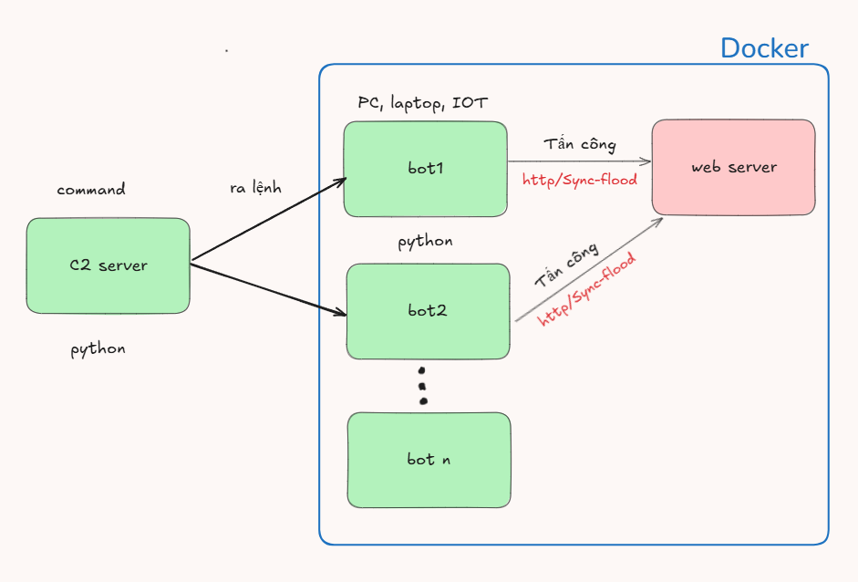
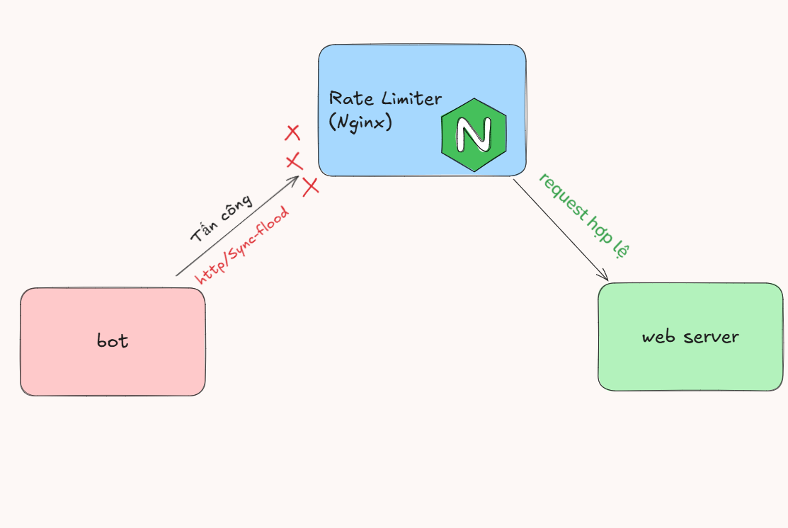

# DDoS Attack Demo, trải nghiệm thú vị

## Kiến trúc và Mô hình hệ thống

### a. Kiến trúc tổng thể mạng botnet

Mạng botnet bao gồm một máy chủ C2 (Command and Control) và nhiều bot được viết bằng Python, chạy dưới các container Docker. Mình viết 1 con bot xong copy ra thôi 😅  

Khi C2 phát lệnh tấn công, các bot sẽ đồng loạt gửi lưu lượng truy cập giả mạo (HTTP hoặc SYN Flood) đến máy chủ nạn nhân.

### b. Mô hình hóa bằng Docker

Để mô phỏng tấn công DDoS thực tế, ta tạo nhiều container bot sử dụng Docker. 

Mỗi bot chạy cùng một mã nguồn Python (`bot.py`) và kết nối đến máy chủ C2 - Command & Control (`c2_server.py`) qua địa chỉ `host.docker.internal`.  
Đây thực ra là địa chỉ localhost được kết nối từ bên trong docker. Trên thực tế, đây sẽ là địa chỉ IP thật của máy chủ. Nhưng trỏ vào localhost test thôi nhé ae. Mình không chịu trách nghiệm đâu 🤣

**Lưu ý:** `c2_server` sẽ được chạy trực tiếp trên máy để tiện ra lệnh. Do khi mình chạy docker thì ko thể tìm được cách truy cập terminal của C2 server =))

### Cấu trúc Docker Compose

- **Bot**: Hệ thống gồm nhiều container nhân bản chạy client bot, sẵn sàng nhận lệnh từ C2
- Với cấu hình của laptop `ASUS TUF gaming F15`, Mình vít max được 4 máy bot là cùng. Quá thì đơ máy

## c. Phòng thủ DDoS bằng Rate Limiter (Nginx)

> Nginx ở đây đóng vai trò là 1 reverse-proxy, đứng trước server để chặn các request với tần suất lớn bất thường (bot)
>
>  Mình chọn Nginx chủ yếu là để tìm hiểu về container và cách cấu hình web server. Kiến thức thu được khá hữu ích
- `Rate limiting` là một kỹ thuật được sử dụng để kiểm soát tốc độ truy cập hoặc số lượng yêu cầu mà một người dùng hoặc một địa chỉ IP có thể thực hiện đến một hệ thống trong một khoảng thời gian nhất định. 
- Mục tiêu của `rate limiting` là ngăn chặn việc lạm dụng tài nguyên, bảo vệ hệ thống khỏi các cuộc tấn công brute-force, và đặc biệt là giảm thiểu tác động của các cuộc tấn công DDoS, bao gồm cả HTTP Flood.
- Tuy nhiên, nếu bị tấn công bằng `SYN Flood` thì chịu.😒 Vì đó là layer 3, kết nối TCP chưa được thiết lập. Nginx hoạt động ở tầng ứng dụng (layer 7) nên ko có tác dụng.
