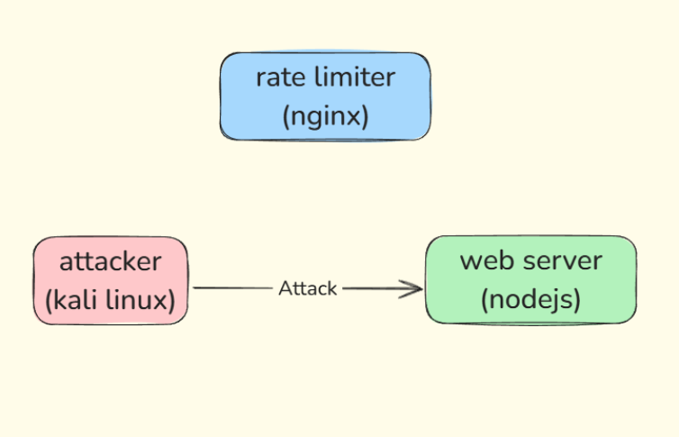

# DoS Protection Demo

This project demonstrates DoS protection using Nginx rate limiting in front of a Node.js application.

## Architecture

```
dos-demo/
│
├── docker-compose.yml          # Defines the multi-container setup
│
├── node/                       # Backend service
│   ├── Dockerfile             # Node.js container setup
│   └── server.js              # Simple HTTP server
│
├── nginx/                      # Reverse proxy with rate limiting
│   ├── Dockerfile             # Nginx container setup
│   └── default.conf           # Nginx configuration with rate limiting
│
└── attacker/                   # Testing container
    └── Dockerfile             # Contains tools like hping3 and wrk
```




## Components

- **Node.js Server**: Simple HTTP service running on port 3000
- **Nginx**: Reverse proxy with rate limiting (5 requests/second)
- **Attacker**: Container with testing tools for simulating DoS attacks

## Network Setup

Services are connected through an isolated Docker network:
- Node.js: 172.20.0.2
- Nginx: 172.20.0.3
- Attacker: 172.20.0.4

## Usage

1. Build and start the services:
```bash
docker-compose up -d
```

2. Access the application:
- Via Node.js directly: http://localhost:3000
- Via Nginx (rate-limited): http://localhost:80

3. Test rate limiting using the attacker container:
```bash
docker-compose exec attacker wrk -t2 -c100 -d30s http://nginx
```